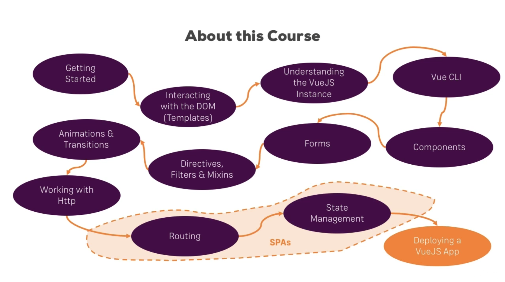

# vue-example
Building example using VueJS step by step, you just follow up this project.

- Author : [SeolHun](https://github.com/Seolhun)
- IDE : SublimeText3 or webstorm(Vue Cli)
- Started Date : 2017-08-30
---
- Reference
	- [en-Vue.js](https://vuejs.org/)
	- [ko-Vue.js](https://kr.vuejs.org/v2/guide/installation.html)

- Course

- Process
1. When I have a time to study VueJS, Adding the example step by step.
2. Course name is simple. ex) directive > ch1 : if you want know details, just read README.md.

