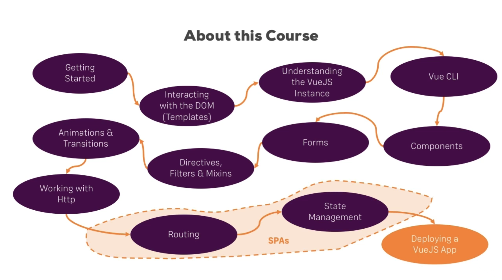
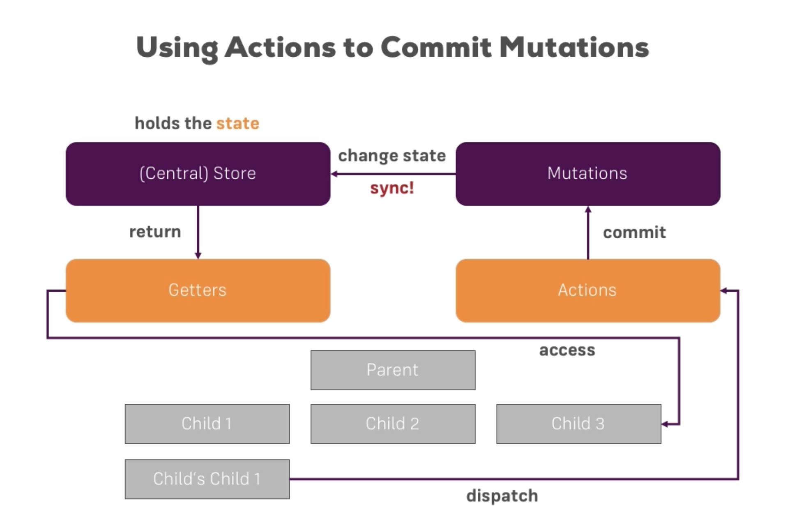

# vue-example
Building example using VueJS step by step, you just follow up this project.

- Author : [SeolHun](https://github.com/Seolhun)
- IDE : SublimeText3 or webstorm(Vue Cli)
- Started Date : 2017-08-30
---
- Reference
	- [en-Vue.js](https://vuejs.org/)
	- [ko-Vue.js](https://kr.vuejs.org/v2/guide/installation.html)
	- [Udemy - Maximilian Schwarzmüller - Vue](https://www.udemy.com/vuejs-2-the-complete-guide/learn/v4/overview)

- Course

- Chapter Details
---
- Vue JS
1. [ch1.Template](https://github.com/Seolhun/vue-example/tree/master/vuejs/ch1)
2. [ch2.Directive](https://github.com/Seolhun/vue-example/tree/master/vuejs/ch2)
3. [ch3.Dynamic CSS](https://github.com/Seolhun/vue-example/tree/master/vuejs/ch3)
    - CSS
4. [ch4.Dom Interaction](https://github.com/Seolhun/vue-example/tree/master/vuejs/ch4)
	- if, else-if, else, show
	- for
5. [ch5.Simple Example](https://github.com/Seolhun/vue-example/tree/master/vuejs/ch5***)
    - Human vs Monster
6. [ch6.Instance & Mount](https://github.com/Seolhun/vue-example/tree/master/vuejs/ch6)
    - Instance & Mount
7. [ch7.VueJS Instance LifeCycle](https://github.com/Seolhun/vue-example/tree/master/vuejs/ch7***)
    - Instance LifeCycle
8. [ch8.Components](https://github.com/Seolhun/vue-example/tree/master/vuejs/ch8)
    - Multiple Components

---
- Vue Cli with Webpack
1. [Getting Started Vue Cli](https://github.com/Seolhun/vue-example/tree/master/cli/ch1)
2. [Parents & child components and Props control](https://github.com/Seolhun/vue-example/tree/master/cli/ch2)
3. [Passing content with Slot](https://github.com/Seolhun/vue-example/tree/master/cli/ch3)
4. [Conponents](https://github.com/Seolhun/vue-example/tree/master/cli/ch4)
5. [Form & Vue Model](https://github.com/Seolhun/vue-example/tree/master/cli/ch5)
6. [Directives ](https://github.com/Seolhun/vue-example/tree/master/cli/ch6)
7. [Filter & Mixins](https://github.com/Seolhun/vue-example/tree/master/cli/ch7)
8. [Animation](https://github.com/Seolhun/vue-example/tree/master/cli/ch8)
9. [Http](https://github.com/Seolhun/vue-example/tree/master/cli/ch9)
10. [Router](https://github.com/Seolhun/vue-example/tree/master/cli/ch10)
11. [Vuex](https://github.com/Seolhun/vue-example/tree/master/cli/ch11)

