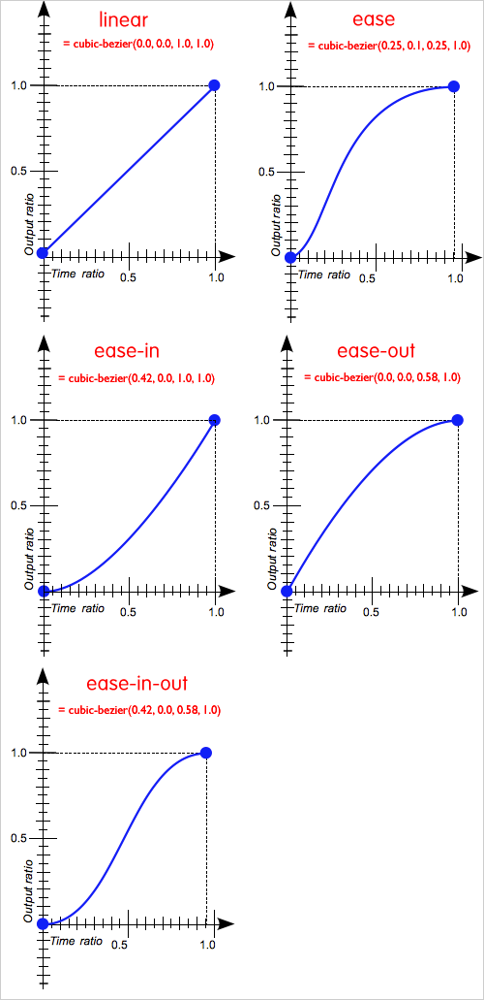

# Vue Study In Incheon - Day 1.

- Author : [SeolHun](https://github.com/Seolhun)
- IDE : SublimeText3 or Webstorm
- Version : Vue 2.5.3
- Started Date : 2017.11.09
---
#### Presentation
- Transitions & Animation
    - 진입/진출 그리고 리스트 트랜지션
    - 트렌지션 상태

#### Content
###### 1. 진입/진출 그리고 리스트 트랜지션 - presentation1.html
1 개요
- Vue는 항목이 DOM에 삽입, 갱신 또는 제거 될 때 트랜지션 효과를 적용하는 다양한 방법을 제공합니다. 여기에는 다음과 같은 도구가 포함됩니다.
    - CSS 트랜지션 및 애니메이션을 위한 클래스를 자동으로 적용합니다.
    - [Animate.css](https://daneden.github.io/animate.css/)와 같은 타사 CSS 애니메이션 라이브러리 통합
    - 트랜지션 훅 중에 JavaScript를 사용하여 DOM을 직접 조작
    - [Velocity.js](http://velocityjs.org/)와 같은 써드파티 JavaScript 애니메이션 라이브러리 통합
        - Velocity는 jQuery의 $ .animate ()와 동일한 API를 사용하는 애니메이션 엔진입니다. 
        - jQuery를 사용하지 않고 Velocity는 작동합니다. 엄청나게 빠르며 컬러 애니메이션, 변형, 루프, easings, SVG 지원 및 스크롤 기능이 있습니다. 
        - jQuery와 CSS 전환을 결합한 최상의 방법입니다.

    
- `transition` 컴포넌트로 싸여진 엘리먼트가 삽입되거나 제거 될 때 일어납니다:
    - Vue는 대상 엘리먼트에 CSS 트랜지션 또는 애니메이션이 적용되었는지 여부를 자동으로 감지합니다. 그렇다면 CSS 트랜지션 클래스가 적절한 타이밍에 추가/제거됩니다.
    - 트랜지션 컴포넌트가 JavaScript 훅를 제공하면 이러한 훅은 적절한 타이밍에 호출됩니다.
    - CSS 트랜지션 / 애니메이션이 감지되지 않고 JavaScript 훅이 제공 되지 않으면 삽입 또는 제거를 위한 DOM 작업이 다음 프레임에서 즉시 실행됩니다 (참고: 이는 Vue의 nextTick 개념과는 다른 브라우저 애니메이션 프레임입니다).

---
2. `트랜지션 클래스`
    - 진입 / 진출 트랜지션에는 네가지 클래스가 적용됩니다.
        - v-enter
            - enter의 시작 상태. 엘리먼트가 삽입되기 전에 적용되고 한 프레임 후에 제거됩니다.
        - v-enter-active
            - enter에 대한 활성 및 종료 상태. 엘리먼트가 삽입되기 전에 적용됩니다. 트랜지션 / 애니메이션이 완료되면 제거됩니다.
        - v-enter-to
            - 2.1.8 이상 버전에서 지원합니다. 진입 상태의 끝에서 실행됩니다. 엘리먼트가 삽입된 후 (동시에 v-leave가 제거됨), 트랜지션/애니메이션이 끝나면 제거되는 하나의 프레임을 추가했습니다.
        - v-leave
            - leave를 위한 시작 상태. 진출 트랜지션이 트리거 될 때 적용되고 한 프레임 후에 제거됩니다.
        - v-leave-active
            - leave에 대한 활성 및 종료 상태. 진출 트랜지션이 트리거되면 적용되고 트랜지션 / 애니메이션이 완료되면 제거됩니다.
        - v-leave-to
            - 2.1.8 이상 버전에서 지원합니다. 진출 상태의 끝에서 실행됩니다. 진출 트랜지션이 트리거되고 (동시에 v-leave가 제거됨), 트랜지션/애니메이션이 끝나면 제거되는 하나의 프레임을 추가했습니다.
        
    - ** Work Flow **
        - enter > enter-active > enter-to
        - leave > leave-active > leave-to
        
    > 

---
- 들어가기 전 참고 사항 
    - [About Animation CSS3](http://ielselog.blogspot.kr/2013/09/understand-css-trasition.html)
    > 

    - linear  
        transition-timing-function을 linear로 설정하면 변화가 시작부터 종료까지 동일한 속도로 일어난다. 
    - ease
        - 극초반은 느리게, 초반은 빠르게, 종료지점은 느리게 변화가 진행된다. 
    - ease-in
        - ease-in은 시작지점의 변화가 천천히 진행된다. 
    - ease-out  
        - ease-out은 종료지점의 변화가 천천히 진행된다. 
    - ease-in-out  
        - ease-in-out은 시작지점과 종료지점의 변화가 천천히 진행된다. 
    - cubic-bezier(여기서 꼭 참고할 것)
        - 변화가 점진적으로 진행되지 않고, 주어진 설정과 간격에 따라 일시에 진행되는 step-start, step-end, steps 가 있다. 

---    
**See Examples**
1. Animation을 구현하는 방법
    1. CSS 트랜지션
    - transition 컴포넌트로 싸여진 엘리먼트가 삽입되거나 제거 될 때 일어납니다.
    - Vue는 대상 엘리먼트에 CSS 트랜지션 또는 애니메이션이 적용되었는지 여부를 자동으로 감지합니다.
    - CSS 트랜지션 클래스가 적절한 타이밍에 추가 / 제거됩니다.
    
    2. CSS 애니메이션
    - CSS 애니메이션은 CSS 트랜지션과 같은 방식으로 적용됩니다. 
    - **차이점은 요소가 삽입 된 직후에 v-enter가 제거되지 않지만 animationend 이벤트에 있습니다.**
    
    3. 사용자 지정 트랜지션 클래스
    - 다음 속성을 제공하여 사용자 정의 트랜지션 클래스를 지정할 수도 있습니다.
    - 이것들은 원본 클래스 명을 오버라이드 합니다. 이는 Vue의 트랜지션 시스템을 Animate.css와 같은 기존 CSS 애니메이션 라이브러리와 결합하려는 경우 특히 유용합니다.
        - enter-class
        - enter-active-class
        - enter-to-class (2.1.8+)
        - leave-class
        - leave-active-class
        - leave-to-class (2.1.8+)
        
    4. JavaScript 훅
        - 속성에서 JavaScript 훅을 정의할 수 있습니다.
        ```html
        <transition
         v-on:before-enter="beforeEnter"
         v-on:enter="enter"
         v-on:after-enter="afterEnter"
         v-on:enter-cancelled="enterCancelled"
        
         v-on:before-leave="beforeLeave"
         v-on:leave="leave"
         v-on:after-leave="afterLeave"
         v-on:leave-cancelled="leaveCancelled"
        >
         <!-- ... -->
        </transition>  
        ```      
---
1. 최초 렌더링 시 트랜지션
- 노드의 초기 렌더에 트랜지션을 적용하고 싶다면 appear 속성을 추가 할 수 있습니다 :
```html
<transition appear>
  <!-- ... -->
</transition>
```
- 기본적으로 진입 및 진출에 지정된 트랜지션을 사용합니다. 그러나 원하는 경우 사용자 정의 CSS 클래스를 지정할 수도 있습니다.
```html
<transition
  appear
  appear-class="custom-appear-class"
  appear-to-class="custom-appear-to-class" (2.1.8+)
  appear-active-class="custom-appear-active-class"
>
  <!-- ... -->
</transition>
```

2. 트랜지션 모드
- 트랜지션 문제점
    - On, Off과 동시에 발현되는 문제.
    - 다른 트랜지션이 진행되는 동안 하나의 트랜지션이 트랜지션됩니다. 이것은 <transition>의 기본 동작입니다 
    - 들어오고 나가는 것이 동시에 발생합니다.
- **해결책** : 동시 들어가고 떠나는 트랜지션이 항상 바람직한 것은 아니기 때문에 Vue는 몇 가지 대안을 제공합니다 트랜지션 모드
    - in-out: 처음에는 새로운 엘리먼트가 트랜지션되고, 완료되면 현재 엘리먼트가 트랜지션됩니다.
    - out-in: 현재 엘리먼트가 먼저 트랜지션되고, 완료되면 새로운 요소가 바뀝니다.
    
    
3. 리스트 트랜지션
- 지금까지 다음과 같은 트랜지션을 다루었습니다.
    - 개별 노드들
    - 한번에 하나만 렌더링 되는 여러 노드
- 그렇다면v-for를 사용하여 동시에 렌더링 하고자 하는 항목의 전체 목록이 있는 경우는 어떨까요? **이 경우 우리는 <transition-group> 컴포넌트를 사용합니다.** 
- 예를 들어보기 전에 이 컴포넌트에 대해 알아야 할 몇 가지 중요한 사항이 있습니다.
    - <transition> 과 달리, 실제 요소인 <span>을 렌더링합니다. tag 속성으로 렌더링 된 요소를 변경할 수 있습니다.
    - 엘리먼트의 내부 구현은 항상 필요합니다 고유한 key 속성을 갖습니다
    
4. 리스트 이동 트랜지션
- <transition-group> 컴포넌트는 또 다른 속임수를 가지고 있습니다. 
- 그것은 진입과 진출 것뿐만 아니라 위치의 변화도 생생하게 표현할 수 있습니다. 이 기능을 사용하기 위해 알아야 할 유일한 새로운 개념은 아이템이 위치를 바꿀 때 추가되는 v-move 클래스를 추가하는 것입니다. 
- 다른 클래스와 마찬가지로 접두어는 제공된 name 속성 값과 일치하며 move-class 속성을 사용하여 클래스를 수동으로 지정할 수도 있습니다.
- 이 클래스는 다음과 같이 트랜지션 타이밍과 easing curve을 지정하는 데 주로 유용합니다.


5. [트랜지션 재사용](https://kr.vuejs.org/v2/guide/transitions.html#트랜지션-재사용)
- 트랜지션은 Vue의 컴포넌트 시스템을 통해 재사용 할 수 있습니다.
- 재사용 할 수있는 트랜지션을 만드려면 루트에 <transition>또는 <transition-group> 컴포넌트를 놓은 다음 자식을 트랜지션 컴포넌트에 전달하면됩니다.
```vue
Vue.component('my-special-transition', {
  template: '\
    <transition\
      name="very-special-transition"\
      mode="out-in"\
      v-on:before-enter="beforeEnter"\
      v-on:after-enter="afterEnter"\
    >\
      <slot></slot>\
    </transition>\',
  methods: {
    beforeEnter: function (el) {
      // ...
    },
    afterEnter: function (el) {
      // ...
    }
  }
})

Vue.component('my-special-transition', {
  functional: true,
  render: function (createElement, context) {
    var data = {
      props: {
        name: 'very-special-transition',
        mode: 'out-in'
      },
      on: {
        beforeEnter: function (el) {
          // ...
        },
        afterEnter: function (el) {
          // ...
        }
      }
    }
    return createElement('transition', data, context.children)
  }
})
```

6. 동적 트랜지션 - (Example-8)
- Vue의 트랜지션도 데이터 기반입니다! 동적 변환의 가장 기본적인 예제는 name 속성을 동적 속성에 바인딩합니다.
```html
<transition v-bind:name="transitionName">
 <!-- ... -->
</transition>
```
- 이는 Vue의 트랜지션 클래스 규칙을 사용하여 CSS 트랜지션/애니메이션을 정의하고 단순히 트랜지션하려는 경우에 유용 할 수 있습니다.
- 실제로 모든 트랜지션 속성은 동적으로 바인딩 될 수 있습니다. 그리고 그것은 단지 속성이 아닙니다. 
- **이벤트 훅은 단지 메소드이기 때문에 컨텍스트의 모든 데이터에 액세스 할 수 있습니다.** 즉, 컴포넌트의 상태에 따라 JavaScript 트랜지션이 다르게 동작 할 수 있습니다.

---
###### 2. 트렌지션 상태 - presentation2.html

1. 감시자와 애니메이션 상태
- 감시자를 사용하면 숫자 속성의 변경 사항을 다른 속성으로 애니메이션 할 수 있습니다. 처음에는 복잡해 보일 수도 있으므로 Tween.js를 사용하여 예제를 살펴 보겠습니다.

2. 동적 상태 트랜지션
- Vue의 트랜지션 컴포넌트와 마찬가지로 데이터 백업 상태 트랜지션을 실시간으로 업데이트 할 수 있으므로 프로토 타이핑에 특히 유용합니다! 간단한 SVG 다각형을 사용해도, 변수를 조금씩 사용하기 전까지는 생각하기 어려운 많은 효과를 얻을 수 있습니다.